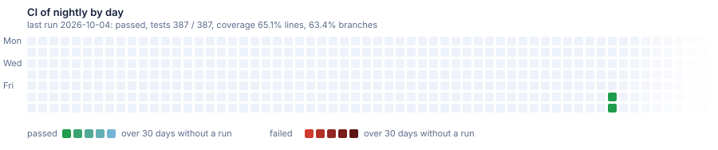

# Sample: nightly

The flags of full, generated from the template's dev once a day when it has moved. A red CI here is a break in dev before a release.

[](https://dnsk.sawking.tech/samples.html#nightly)

Generated from DotNetSolutionKit dev at [bfc13cd](https://github.com/sawking-tech/DotNetSolutionKit/commit/bfc13cdbcc408c032d34a335b68721a3efcc0e1c), not a release, with:

```bash
dotnet new DotNetSolutionKit -N ST -P DotNetSolutionKit.Samples -S Orders -M false --GitHubCiCd true --Messaging outbox -I true --DiffApi true --FeatureFlags true --HierarchyRules true --Storage true --ClickHouse true
dotnet new DotNetSolutionKit -N ST -P DotNetSolutionKit.Samples -S Billing --Messaging outbox -I true --DiffApi true --FeatureFlags true --Storage true --ClickHouse true
```

Nothing here is edited by hand: the branch is replaced when the template moves on.
