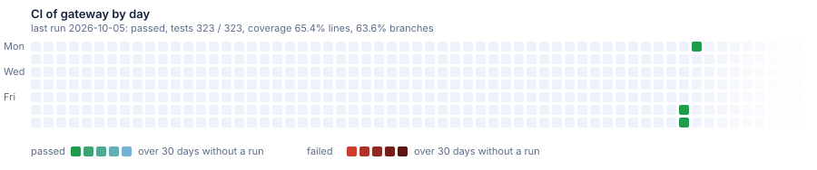

# Sample: gateway

Two services behind a YARP gateway that validates the token and forwards the user.

[](https://dnsk.sawking.tech/samples.html#gateway)

Generated from [DotNetSolutionKit v2.7.0](https://github.com/sawking-tech/DotNetSolutionKit/releases/tag/v2.7.0) with:

```bash
dotnet new DotNetSolutionKit -N ST -P DotNetSolutionKit.Samples -S Orders -M false --GitHubCiCd true
dotnet new DotNetSolutionKit -N ST -P DotNetSolutionKit.Samples -S Billing
dotnet new DotNetSolutionKit -N ST -P DotNetSolutionKit.Samples -S Gateway --ApiGateway true
```

Nothing here is edited by hand: the branch is replaced when the template moves on.
