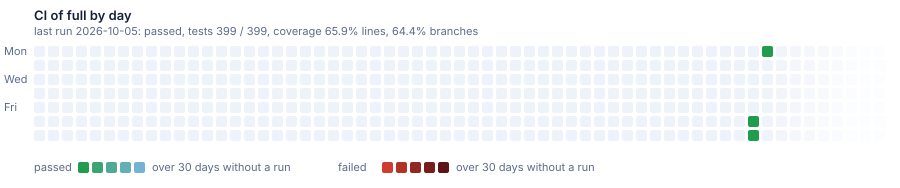

# Sample: full

Every flag: the bus with an outbox, Infisical, feature flags, the API diff, access rules over a tenant tree, object storage, ClickHouse; two services.

[](https://dnsk.sawking.tech/samples.html#full)


Generated from [DotNetSolutionKit v2.7.0](https://github.com/sawking-tech/DotNetSolutionKit/releases/tag/v2.7.0) with:

```bash
dotnet new DotNetSolutionKit -N ST -P DotNetSolutionKit.Samples -S Orders -M false --GitHubCiCd true --Messaging outbox -I true --DiffApi true --FeatureFlags true --HierarchyRules true --Storage true --ClickHouse true
dotnet new DotNetSolutionKit -N ST -P DotNetSolutionKit.Samples -S Billing --Messaging outbox -I true --DiffApi true --FeatureFlags true --Storage true --ClickHouse true
```

Nothing here is edited by hand: the branch is replaced when the template moves on.

## The samples

| Branch | What it shows | CI |
|---|---|---|
| [`single`](https://github.com/sawking-tech/DotNetSolutionKit.Samples/tree/single) | One service with the defaults: PostgreSQL, Hangfire, docker compose files, and CI. | [](https://github.com/sawking-tech/DotNetSolutionKit.Samples/actions/workflows/ci.yml?query=branch%3Asingle) |
| [`gateway`](https://github.com/sawking-tech/DotNetSolutionKit.Samples/tree/gateway) | Two services behind a YARP gateway that validates the token and forwards the user. | [](https://github.com/sawking-tech/DotNetSolutionKit.Samples/actions/workflows/ci.yml?query=branch%3Agateway) |
| [`full`](https://github.com/sawking-tech/DotNetSolutionKit.Samples/tree/full) | Every flag: the bus with an outbox, Infisical, feature flags, the API diff, access rules over a tenant tree, object storage, ClickHouse; two services. | [](https://github.com/sawking-tech/DotNetSolutionKit.Samples/actions/workflows/ci.yml?query=branch%3Afull) |
| [`full-alt`](https://github.com/sawking-tech/DotNetSolutionKit.Samples/tree/full-alt) | SQL Server, xUnit, secrets from Vault, Kubernetes manifests and the audit journal, which rides on the bus with an outbox; two services. | [](https://github.com/sawking-tech/DotNetSolutionKit.Samples/actions/workflows/ci.yml?query=branch%3Afull-alt) |
| [`full-dev`](https://github.com/sawking-tech/DotNetSolutionKit.Samples/tree/full-dev) | The flags of full and the ones dev adds before a release, generated from the template's dev once a day when it has moved. A red CI here is a break in dev before a release. | [](https://github.com/sawking-tech/DotNetSolutionKit.Samples/actions/workflows/ci.yml?query=branch%3Afull-dev) |

The CI of each branch by day, as [the samples page](https://dnsk.sawking.tech/samples.html) shows it:

[](https://dnsk.sawking.tech/samples.html#single)

[](https://dnsk.sawking.tech/samples.html#gateway)

[](https://dnsk.sawking.tech/samples.html#full)

[](https://dnsk.sawking.tech/samples.html#full-alt)

[](https://dnsk.sawking.tech/samples.html#full-dev)


Each square is a day in UTC, Monday at the top and Sunday at the bottom. A day shows the result of the
last CI run up to it: green for a pass, red for a failure. A day without a run shows how long ago the
run was: after a pass it turns a step bluer every 2 days, after a failure a little darker every day,
ice blue or dark red from day 30 on. A day keeps its colour; a new run makes its day green or red
again. A pale square is a day before the first run; the fading squares on the right are the weeks to
come.

Once a day [regenerate](.github/workflows/regenerate.yml) checks the template's master: what reaches
master is a release, and every release branch is generated again from a new one, pushed, and its CI runs.
full-dev follows dev instead, where the next release is built: it is generated again when dev has moved.
After each CI run of a branch, [report](.github/workflows/report.yml) writes the run into the branch's
reports/<branch>/ folder: tests, coverage, time and the branch's files, one file per release, and
ci.svg, the picture of its days above.
The automation is in [.samples](.samples).
