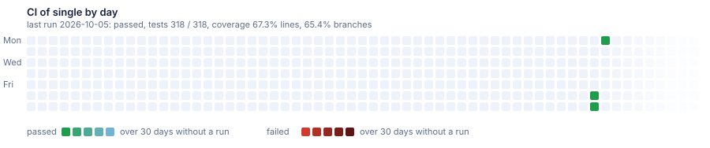

# Sample: single

One service with the defaults: PostgreSQL, Hangfire, docker compose files, and CI.

[](https://dnsk.sawking.tech/samples.html#single)


Each square is a day in UTC, Monday at the top and Sunday at the bottom. A day shows the result of the
last CI run up to it: green for a pass, red for a failure. A day without a run shows how long ago the
run was: after a pass it turns a step bluer every 2 days, after a failure a little darker every day,
ice blue or dark red from day 30 on. A day keeps its colour; a new run makes its day green or red
again. A pale square is a day before the first run; the fading squares on the right are the weeks to
come.

Generated from [DotNetSolutionKit v2.7.0](https://github.com/sawking-tech/DotNetSolutionKit/releases/tag/v2.7.0) with:

```bash
dotnet new DotNetSolutionKit -N ST -P DotNetSolutionKit.Samples -S Orders -M false --GitHubCiCd true
```

Nothing here is edited by hand: the branch is replaced when the template moves on.
