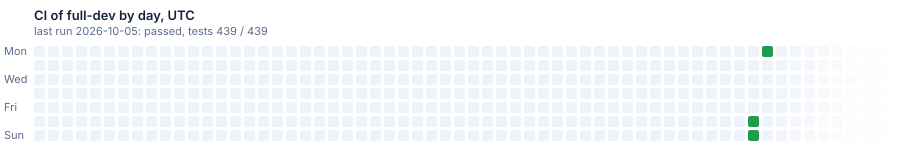

# Sample: full-dev

The flags of full and the ones dev adds before a release, generated from the template's dev once a day when it has moved. A red CI here is a break in dev before a release.

[](https://dnsk.sawking.tech/samples.html#full-dev)


Each square is a day in UTC, Monday at the top and Sunday at the bottom. A day shows the result of the
last CI run up to it: green for a pass, red for a failure. A day without a run shows how long ago the
run was: after a pass it turns a step bluer every 2 days, after a failure a little darker every day,
ice blue or dark red from day 30 on. A day keeps its colour; a new run makes its day green or red
again. A pale square is a day before the first run; the fading squares on the right are the weeks to
come.

Generated from DotNetSolutionKit dev at [4217f9c](https://github.com/sawking-tech/DotNetSolutionKit/commit/4217f9c813a967ad96133ea15d248f46225ad8f9), not a release, with:

```bash
dotnet new DotNetSolutionKit -N ST -P DotNetSolutionKit.Samples -S Orders -M false --GitHubCiCd true --Messaging outbox -I true --DiffApi true --FeatureFlags true --HierarchyRules true --Storage true --ClickHouse true --MongoDB true --Notify email
dotnet new DotNetSolutionKit -N ST -P DotNetSolutionKit.Samples -S Billing --Messaging outbox -I true --DiffApi true --FeatureFlags true --Storage true --ClickHouse true --MongoDB true --Notify email
```

Nothing here is edited by hand: the branch is replaced when the template moves on.
